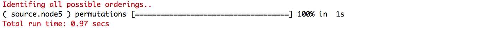

<!-- rmarkdown v1 -->

* [Introduction](#intro)
* [Overview](#over)
* [Getting started](#start): toy example
    + [Function `sourceSet`:](#sourcefun) input arguments
    + [Data preparation](#data)
    + [Quick usage](#quick)
    + [Understand the output](#output)
    + [Statistics:](#stat) `infoSource`
    + [Visual summary:](#visual) `easyLookSource`, `sourceSankeyDiagram`
    + [Cytoscape:](#cytovisual) `sourceCytoscape`
* [Getting deeper](#deep): real dataset
    + [Data preparation:](#dataALL) `ALL` dataset
    + [Pathway:](#graphite) `graphite` package
    + [Results and discussion](#ALLresults)
* [Note on Cytoscape](#cyto)


<hr style="height:1px;border-top:1px solid #66b2ff" />

# Introduction {#intro}
One of the most promising and widely used computational approaches for analyzing gene expression data is gene set analysis. Gene set analysis moves from a gene-centered perspective towards a gene set-centered perspective,  where the gene sets are usually  defined as groups of functionally related genes. An example of a gene set is a group of genes participating in the same pathway.


Among gene set analyses,  topological pathway analysis aims to improve inferential analysis by exploiting the explicit pathway information on biological interactions. Indeed, a biological pathway can be converted into a graphical structure, where nodes represent genes and edges represent biochemical interactions between them. 


All methods proposed within the context of topological pathway analysis use marginal approaches and are therefore unable to distinguish between  the so-called primary genes representing the source of perturbation -- for example,  a mutation, a copy number variation or an epigentic change -- from those that are merely affected by the propagation of that perturbation. 

**`SourseSet`** implements a new method for identifying a primary dysregulation within a perturbed pathway. Set within the framework  of Gaussian graphical models, our method compares all marginal and conditional distributions induced by the underlying graph, and uses the results to infer  the set of primary genes potentially responsible for the differential behavior. For a detailed exposition, we refer to the original articles [@SourceSetmethod].


<div style="background-color: #F0F8FF;border-left: 6px solid #87CEFA; padding:5px 10px 5px 10px;"><p>
Although our primary aim is the analysis of gene expression data, the proposed method  is general and can be applied whenever  data from two conditions are assumed to come from two  multivariate normal distributions with a common and known graphical structure. For this reason, in the first part of this vignette, we use a more general terminology: _variables_ and _graphs_, instead of  _genes_ and _pathways_.
</p></div>

<hr style="height:1px;border-top:1px solid #66b2ff" />

# Overview {#over}


Given a list of graphs representing a chosen set of pathways, and a matrix of gene expression values measured in two experimental conditions, **`SourceSet`** functions 

* identify for each graph a set of variables potentially driving the differences between the two experimental conditions;
* perform a meta-analysis on the entire set of input graphs providing replicable summaries of research findings through additional visualization tools and statistics. 

**`SourceSet`** contains four core functions: `sourceSet`  implements the proposed algorithm, while `infoSource`, `easyLookSource`, `sourceSankeyDiagram` provide the user with tools for visualizing and interpreting the obtained results. In addition, `sourceCytoscape` and `sourceUnionCytoscape` provide a connection with Cytoscape, a well known bioinformatics tool for visualizing, exploring and manipulating biological networks.

In the following,  two examples illustrate the use of the *`SourceSet`* package: 

1. Section [Getting started](#start) uses a toy example to introduce the main idea behind the source set, as well as to offer a first look at the arguments and the output of the main functions;
2.  Section [Getting deeper](#deep) features an analysis of a real dataset, taken from a well known benchmark ALL. 


<hr style="height:1px;border-top:1px solid #66b2ff" />

# Getting started {#start}

Install **`SourceSet`**  from the CRAN repository.


```r
install.packages("SourceSet")
help(package = "SourceSet")
```

### Function `sourceSet`: input arguments {#sourcefun}

We first have a look at the main function `sourceSet` which performs the actual analysis.  

```r
library(SourceSet)
#?sourceSet
```

The user is required to specify the following arguments: 

* `data`: a data matrix with variables (genes) in columns, and statistical units (samples) in rows;
* `classes`: a vector of length equal to the number of rows of `data`. It indicates the class (condition) of each statistical unit. Only two classes, labeled as 1 and 2, are allowed;;
* `graphs`:  a list of graphNEL objects (representing pathways). It is advisable to assign to each graph a name (without special characters).

Two additional arguments:

* `permute`: if `TRUE` permutations $p$-values are provided; if `FALSE`, asymptotic $p$-values are returned; 
* `shrink`: if `TRUE`, regularized estimation of the covariance matrices is performed; otherwise, maximum likelihood estimation is used. Maximum likelihood estimates can be used only if the sample size of the smaller class is larger than the size of the largest clique in the input graphs, otherwise the argument will be automatically set to `TRUE`. If  `TRUE`, then `permute` also needs to be `TRUE`.


### Data preparation {#data}

We consider an example featured in the Simulation study of @SourceSetpackage. All the necessary parameters are contained in the data object `data("simulation")`. For  details on generating parameters which emulate  two experimental conditions within the Gaussian graphical models framework, we refer to the Supplementary material of the main article and [**`simPATHy`** CRAN package](https://CRAN.R-project.org/package=simPATHy ).


```r
data("simulation")
names(simulation)
```

```
## [1] "graph"      "condition1" "condition2"
```

In this case, it was assumed that the perturbation  affects directly only gene 5 (primary dysregulation). The perturbation is then propagated towards remaining genes (secondary dysregulation) by means of a network `simulation$graph`. 

Parameters of the first or control condition, the mean $\mu_1$ and the variance matrix $\Sigma_1$,  are given by `simulation$condition1`. Parameters of the second condition,  $\mu_2$ and  $\Sigma_2$, reflecting the effect of the foregoing strong perturbation  are contained in `simulation$condition2$`5`$`2`. We use these parameters to generate two  random samples of size 50 from the corresponding  multivariate normal distributions.


```r
if ( requireNamespace( "mvtnorm" )  ){

  set.seed(111)
  # sample size
  n<-50
  
  # parameters of control condition
  param.cond1<-simulation$condition1
  
  # parameters of perturbed condition (`5`: true source; `2`: dysregulation intensity, strong)
  param.cond2<-simulation$condition2$`5`$`2`
  
  # condition 1 
  data.cond1<-mvtnorm::rmvnorm(n = n,mean =param.cond1$mu ,sigma =param.cond1$S )
  # condition 2
  data.cond2<-mvtnorm::rmvnorm(n = n,mean =param.cond2$mu ,sigma=param.cond2$S)
  
  # Input arguments for the sourceSet function
  data<-rbind(data.cond1,data.cond2)
  classes<-c(rep(1,nrow(data.cond1)),rep(2,nrow(data.cond2)))
  graphs<-list("source.node5"=simulation$graph)
  
}
```

`simulation$graph`is a `graphNEL` object representing an undirected graph consisting of 10 nodes and 5 cliques. The largest clique contains $p=4$ nodes, and since $n_1=n_2=n=50$ we can set `shrinkage=FALSE`, and use the maximum likelihood estimate of the covariance matrix.  Furthermore, given that $\min(n_1,n_2)\gg p$, we can    use asymptotic $p$-values (`permute=FALSE`). 


```r
simulation$graph
```

```
## A graphNEL graph with undirected edges
## Number of Nodes = 10 
## Number of Edges = 15
```

```r
ripped<-gRbase::rip(simulation$graph)

# number of cliques
length(ripped$cliques)
```

```
## [1] 5
```

```r
# size of larger clique
max(sapply(ripped$cliques,length))
```

```
## [1] 4
```


### Quick usage {#quick}


We use the function `sourceSet` to analyze simulated data. 

A progress bar shows the status of permutations[^permute] and the elapsed time for each input graph. 

```r
result<-sourceSet(graphs ,data ,classes ,seed = 123 ,permute =FALSE ,shrink =FALSE, alpha=0.05  )
class(result)
```

```
## [1] "sourceSetList"
```
<br>

`sourceSet` function returns a `sourceSetList` class object containing useful information in the form of lists, where the number of lists  equals the number of input graph (in this case 1). 
 Each list contains the results of the analysis. In particular,  


* `primarySet`: a character vector containing the names of the variables belonging to the estimated source set  (primary dysregulation).
* `secondarySet`:  a character vector containing the names of the variables belonging to the estimated secondary set (secondary dysregulation).
* `orderingSet`: a list of character vectors containing the names of the variables belonging to the estimated source set of each ordering; the union of these elements represents the secondary dysregulation.
* `Components`: a data frame that contains  information about unique  tests, including their associated $p$-values.
* `Decompositions`: a list of data frames, one for each identified ordering. Each data frame is a subset of size $k$ (i.e., number of cliques), of the `Components` elements.
* `Elements`: cliques and separators of  the underlying decomposable graph (see `Graph`).
* `Thresholds`: a list with information regarding the multiple testing correction.
* `Graph`: decomposable graph used in the analysis. It may differ from the input graph. In fact, if  the input graph is not  decomposable, the function will internally moralize and triangulate it.


```r
names(result$source.node5)
```

```
## [1] "primarySet"     "secondarySet"   "orderingSet"    "Decompositions"
## [5] "Components"     "Elements"       "Threshold"      "Graph"         
## [9] "PvalueGraph"
```

As anticipated, the  _source set_ is able to distinguish the primary dysregulation (5) from the set of nodes affected by the perturbation due to network propagation (3, 4, 6, 10, 8, 9, 7).


```r
# source set: primary disregulation
result$source.node5$primarySet
```

```
## [1] "5"
```

```r
# secondary disregulation
result$source.node5$secondarySet
```

```
## [1] "3"  "4"  "6"  "10" "8"  "9"  "7"
```

```r
# all affected variables
unique(unlist(result$source.node5$orderingSet))
```

```
## [1] "3"  "4"  "5"  "6"  "10" "8"  "9"  "7"
```

### Understand the output {#output}

_Source set_ algorithm decomposes each input graph in $k$ different clique  orderings, where $k$ is the number of maximal cliques for a  given graph. Different orderings are obtained by setting  each clique as the  root  of the underlying junction tree  (`rip` function in  the **`gRbase`** package). This procedure is implemented in the utility function `ripAllRootsClique`.

Each ordering is composed of $k$ components, and each component  is associated to a clique and a separator (the first separator  in the ordering is taken to be empty). A component represents a conditional distribution of the clique variables conditional on the separator variables. The _source set_ algorithm tests equality of these distributions in the two groups. Components may repeat across different orderings, and all information relative to them can be found in  `Decomposition`. In particular, a list of unique components (across all clique orderings) can be found in  `Components`, while the list of variables contained within each clique and separator is in `Elements`.


For the graph of our example, the number of different orderings is 5 and the number of unique components is  13.
For example, when clique `C5` is root, featured components are _comp7_, _comp13_, _comp5_, _comp3_ and _comp12_. In particular, _comp12_ represents the marginal distribution of the clique `C5`, while _comp7_ represents the conditional distribution of the clique `C1` conditional on the separator `S1`.


```r
# number of orderings
length(result$source.node5$Decompositions)
```

```
## [1] 5
```

```r
# number of unique components
nrow(result$source.node5$Components)
```

```
## [1] 13
```

```r
# ordering with root clique 'C3'
result$source.node5$Decompositions$C5
```

```
##        clique separator ind_clique ind_separator component    pvalue
## comp7      C1        S1          1             6     comp7 0.4070312
## comp13     C2        S3          2             8    comp13 0.0000000
## comp5      C3        S4          3             9     comp5 0.2320751
## comp3      C4        S2          4             7     comp3 0.5665353
## comp12     C5        S0          5            10    comp12 0.0000000
```

The function will return an ordering source set ($\hat{D}_{G,i}$) for each of the $k$ orderings. Each set is composed of  the components for which the hypothesis of equality between the two groups was rejected. This information is contained in `orderingSet`, while the information regarding the multiple testing correction can be found in `Threshold`.

If we look at the ordering given by the root `C5`, the adjusted  threshold that controls the FWER at the desired level  $\alpha=$ 0.05 is  0.0051.  The components whose equality is rejected at this level are  _comp13_ e _comp12_.  The set $\hat{D}_{G,i}$ will thus contain both variables in `C2`, and variables in `C5`.


```r
# alpha and corrected threshold
result$source.node5$Threshold[c("alpha","value")]
```

```
## $alpha
## [1] 0.05
## 
## $value
## [1] 0.005068823
```

```r
# ordering source set when 'C5' is used as root clique
result$source.node5$orderingSet$C5
```

```
## [1] "4" "5" "6" "7"
```

```r
# manual indentification of the ordering source set
union(result$source.node5$Elements$C2,result$source.node5$Elements$C5)
```

```
## [1] "4" "5" "6" "7"
```

The estimated source set (or primary set) consists of variables that are common to all orderings source sets (the node 5). While, the secondary set consists of variables that are affected by some form of dysregulation (i.e., appear in at least one ordering source set) but are not responsible for the primary dysregulation. In this case, the algorithm is thus able to distinguish the primary and the secondary dysregolation. 


```r
# source set of each ordering
result$source.node5$orderingSet
```

```
## $C1
## [1] "3" "4" "5"
## 
## $C2
## [1] "4" "5" "6"
## 
## $C3
## [1] "10" "5"  "8"  "9" 
## 
## $C4
## [1] "3" "4" "5"
## 
## $C5
## [1] "4" "5" "6" "7"
```

```r
# primary disregulation
result$source.node5$primarySet
```

```
## [1] "5"
```

```r
# secondary disregulation
result$source.node5$secondarySet
```

```
## [1] "3"  "4"  "6"  "10" "8"  "9"  "7"
```

```r
# all affaceted variables
unique(unlist(result$source.node5$orderingSet))
```

```
## [1] "3"  "4"  "5"  "6"  "10" "8"  "9"  "7"
```


### Statistics {#stat}

Although the interpretation of the source set for a single graph can seem intuitive, the interpretation of the results for a collection of overlapping graphs can be challenging. To simplify this task, **`SourceSet`** offers the function `infoSource`. Given a  `sourceSetList` object, `infoSource` provides useful summaries of the obtained results, guiding the user in identifying interesting variables.


```r
info<-infoSource(result)
names(info)
```

```
## [1] "variable" "graph"
```

The list `info$graph` summarizes the results of the individual input graphs. Here we  find some summary statistics regarding the number of nodes within the estimated source set (`n.primary`), the secondary set (`n.secondary`), within the graph (`n.graph`),  as well as  the number of connected components of the underlying graph (`n.cluster`). The relative size of the estimated source set and the set of all the variable affected by some form of dysregulation (with respect to the graph size) is given in `primary.impact` and `total.impact`, respectively. Finally, a $p$-value for the hypothesis of equality of the two distributions associated to the given graph is reported. 


Table: > info$graph

|             | n.primary| n.secondary| n.graph| n.cluster| primary.impact| total.impact| adj.pvalue|
|:------------|---------:|-----------:|-------:|---------:|--------------:|------------:|----------:|
|source.node5 |         1|           7|      10|         1|            0.1|          0.8|          0|

`info$variable` is a list with information regarding variables of the input graphs. Although some of the indices bear the same name as above, the interpretation is now slightly different. In particular:

+ `n.primary` : number of input graphs in which the genes appears in the associated source set;
+ `n.secondary`:  number of input graphs in which the genes appears to be affected by some form of dysregulation but it is not responsable for primary dysregulation;
+ `n.graph`: the number of input graphs containing the given variable;
+ `specificity`: percentage of input graphs containing the given variable with respect to the total number of input graphs;
+ `primary.impact`: percentage of input graphs, such that the given variable belongs to their estimated source/marginal set, with respect to the total number of input graphs in which the variable appears;
+ `total.impact`: percentage of input graphs, such that the given gene is affected by some form of dysregulation in the considered graph, with respect to the total number of input graphs in which the gene appears; 
+ `relevance`: percentage of the input graphs such that the given variable belongs to their estimated source set, with respect to the total number of input graphs;
+ `score`:  a number ranging from $0$, indicating low significance, to  $(\infty)$,  indicating maximal significance. Computed as the combination of the $p$-values of all components (of all the input graphs) containing the given variable. 


<br>
<div style="background-color: #F0F8FF;border-left: 6px solid #87CEFA; padding:5px 10px 5px 10px;"><p>
Ideally, variables of the primary dysregulation will be elements of the source set in all input graphs that contain them and will thus have high values of  `source.impact` and `score`. However, if  a given variable appears in a single graph, and belongs to its source set, these indices can be deceptive. For this reason, `relevance` serves to identify variables that apart from being good candidates for primary genes, also appear frequently in the input graphs.  Which index is to be preferred depends on the objective of the analysis: in case of exploratory analysis, we suggest to rely on `relevance`.
</p></div> 
<br> 
 
In our toy example, the specificity will be 1 for all the considered variables, while the only variable with `relevance` different from 0 is variable 5. The variable 5 also achieves the maximum score. 


Table:  > info$variable

|   | n.primary| n.secondary| n.graph| specificity| primary.impact| total.impact|   score| relevance|
|:--|---------:|-----------:|-------:|-----------:|--------------:|------------:|-------:|---------:|
|5  |         1|           0|       1|           1|              1|            1|     Inf|         1|
|6  |         0|           1|       1|           1|              0|            1| 1.42706|         0|
|10 |         0|           1|       1|           1|              0|            1| 1.32143|         0|
|8  |         0|           1|       1|           1|              0|            1| 1.32143|         0|
|9  |         0|           1|       1|           1|              0|            1| 1.32143|         0|
|1  |         0|           0|       1|           1|              0|            0| 0.44659|         0|
|2  |         0|           0|       1|           1|              0|            0| 0.44659|         0|
|3  |         0|           1|       1|           1|              0|            1| 0.42099|         0|
|4  |         0|           1|       1|           1|              0|            1| 0.42099|         0|
|7  |         0|           1|       1|           1|              0|            1| 0.00414|         0|


### Visual summary {#visual}

An alternative, more intuitive, way of exploring the results is to use visual summaries offered by `easyLookSource` and `sourceSankeyDiagram`. As before, the input is a `sourceSetList` object. 
Additional parameters may be needed to customize the display.


#### `easyLookSource`

The function `easyLookSource`  summarizes the results  through a heatmap. The plot is composed of a matrix in which rows ($i$) represent  input graphs (pathways) and, columns ($j$) represent variables (genes). Each cell$_{i,j}$ can take one of the following configurations:

* _(2)_ blue color, if the $i$-th gene is in the source set of the $j$-th pathway;
* _(1)_ light blue color, if the $i$-th gene is in the secondary set of the $j$-th pathway;
* _(0)_ gray, if the $i$-th gene belong to the $j$-th pathway;
* _(NA)_ white, if the $i$-th gene does not belong to the $j$-th pathway.

In the plot, the pathways are vertically ordered -- top to bottom -- according to the numbers of nodes in the source set. On the other hand, genes are horizontally ordered -- from left to right-- based on the number of times they appear in a source set.


```r
easyLookSource(result)
```


#### `sourceSankeyDiagram`
The function `sourceSankeyDiagram`  highlights the relationships among nodes, graphs, and source
sets, by  summarizing the results  through a Sankey diagram.  The layout is organized on three levels:

* the first level (left) shows nodes that appear in at least one source sets of the analyzed graphs
* the second level (center) is made up of modules. A module is defined as a set of nodes belonging to a connected subgraph of one pathway, that is also contained in associated source set. A pathway can have multiple modules, and, at the same time, one module can be contained in multiple pathways;
* the third level (right) shows pathways.

The three levels are to be read from left to right. A link between left element a and right element b must be interpret as _"element a is contained in element b"_. 
The implementation of the `sourceSankeyDiagram` function takes advantage of the D3 library (JavaScript), making the plot interactive. In fact, it is possible to vertically shift the displayed elements, and to view some useful information by positioning the cursor over items and links.

To better illustrate this visual tool, we consider a slight modification of our toy example so that   the true source set is composed of variables 5, 9, 8 e 10. 


```r
if(requireNamespace("mvtnorm")){
  set.seed(222)
   
  data2.cond1<-mvtnorm::rmvnorm(n = n,mean =simulation$condition1$mu ,sigma =simulation$condition1$S )
  data2.cond2<-mvtnorm::rmvnorm(n = n,mean =simulation$condition2$`10`$`2`$mu ,sigma =simulation$condition2$`10`$`2`$S)
    
  # Input arguments for the sourceSet function
  data2<-rbind(data2.cond1,data2.cond2)
  classes<-c(rep(1,nrow(data2.cond1)),rep(2,nrow(data2.cond2)))
  graphs<-list("source.node10"=simulation$graph)
    
  result2<-sourceSet(graphs,data2,classes,seed=222,permute = FALSE,shrink = FALSE)
}
```


```r
sourceSankeyDiagram(result2,height = 150,width = 800)
```


### Cytoscape {#cytovisual}

**`SourceSet`** package offers various tools for the analysis and dynamic network  manipulation. The `sourceCytoscape` function, thanks to the connection with the  Cytoscape software,  allows the user to create a collection of graphs to be visualized  in a unique session, while  documenting  interesting findings. Before executing the following two commands, it is necessary to launch Cytoscape  (see [Note on cytoscape](#cyto)).

The input is as before an object of  the `sourceSetList` class.  A subset of the analyzed graphs can be selected by setting the parameter `name.graphs`; if unspecified all analyzed graphs will be visualized. It is also possible to call the  `sourceCytoscape` function multiple times, with all the graphs being visualized in a unique session within a collection specified by `collection.name`.


```r
# Lunch cytoscape and run the following commands

# simulation 1: sourceset composed by variable 5
cytoID.5<-sourceCytoscape(result,collection.name = "Simulation")
# simulation 2: sourceset composed by variable 10,9,8,5
cytoID.10<-sourceCytoscape(result2,collection.name = "Simulation")
```


The visual node attributes size and fill color are defined in a dynamic manner through a visual mapping[^style] based on the indices available by the `infoSource` function (automatically uploaded in the bottom panel - right side). A discrete mapper between _source_ attribute and size is applied: a big size if the variable belongs to the secondary set (_2_), a medium size if the variable belongs to the primary set (_1_), and a small size otherwise (_0_). On the other hand, a color gradient mapper between fill node color and relevance is adopted.

The default style can be changed manually either within  Cytoscape (for further information see [manual](http://manual.cytoscape.org/en/stable/Styles.html)) or within an R package  **`r2cytoscape`** through   _network SUID_ returned by the `sourceCytoscape` function (for further details see  [manual](https://github.com/cytoscape/r2cytoscape)).

<br> <br>


<hr style="height:1px;border-top:1px solid #66b2ff" />

# Getting deeper: ABL/BCR chimera {#deep}

This section guides the user in the source set analysis of a real case study, both in terms of data preparation and results discussion.

As an example, we used a well-known benchmark published by @Chiaretti on Acute Lymphocytic Leukemia (ALL) cells associated with known genotypic abnormalities in adult patients. The dataset is available in [`ALL` BioC package](http://bioconductor.org/packages/ALL/) and consists of microarray expressions and phenotypical information from 128 different individuals affected by ALL. 

The expression values (deriving from Affymetrix single channel technology) are already appropriately normalized according to robust multiarray analysis and quantile normalization.


```r
require("ALL")
data("ALL")
ALL
```

```
## ExpressionSet (storageMode: lockedEnvironment)
## assayData: 12625 features, 128 samples 
##   element names: exprs 
## protocolData: none
## phenoData
##   sampleNames: 01005 01010 ... LAL4 (128 total)
##   varLabels: cod diagnosis ... date last seen (21 total)
##   varMetadata: labelDescription
## featureData: none
## experimentData: use 'experimentData(object)'
##   pubMedIds: 14684422 16243790 
## Annotation: hgu95av2
```


### Data preparation: `ALL` data {#dataALL}

Some genotype abnormalities are known to be responsible for different transformation mechanisms of ALL and, as a consequence, of different response to treatment. For this reason, the assessment will focus on the ability of the source set algorithm to identify genes for which there are documented evidences in the origin of the phenotype under study (i.e., chimera genes).

Comparing patients with and without the B-cell receptor (ABL/BCR) gene rearrangement, we expect that chimera genes will be present in the source set of pathways that contained them. Moreover, we foresee that ABL and BCR appear among the most relevant genes in the meta-analysis. 

We need to retrieve from the `ExpressionSet` object the expression matrix and the corresponding sample information for the individuals of interest. Specifically, we are interested in the subset of patients with B-cell type and BCR/ABL translocation (class 2) or without translocation (class 1). This information is hosted in the `BT` and `mol.biol` columns of `ALL` phenotype data.  


```
##              01005     01010    03002    04007     04008
## 1000_at   7.597323  7.479445 7.567593 7.905312  7.065914
## 1001_at   5.046194  4.932537 4.799294 4.844565  5.147762
## 1002_f_at 3.900466  4.208155 3.886169 3.416923  3.945869
## 1003_s_at 5.903856  6.169024 5.860459 5.687997  6.208061
## 1004_at   5.925260  5.912780 5.893209 5.615210  5.923487
## 1005_at   8.570990 10.428299 9.616713 9.983809 10.063484
## 1006_at   3.656143  3.853979 3.646808 3.547361  3.771648
## 1007_s_at 7.623562  7.543604 7.916954 7.516981  7.726716
## 1008_f_at 8.903547  9.903953 8.494499 8.871669  9.424092
## 1009_at   9.371888  9.322177 9.304982 9.627175  9.189420
```

Moreover, it is  convenient to use Entrez gene IDs instead of manufacturer identifiers. It helps us to map genes in pathways. To this purpose we need the [**`hgu95av2.db`** BioC package](http://bioconductor.org/packages/hgu95av2.db/), as required in the annotation specification of ALL dataset (see `ALL@annotation`). 

As some IDs could be repeated or not annotated, the final dataset will generally have a different size from the initial one; in case of not unique mapping IDs, we summarized them by the mean value.


```
## [1] 8582
```

After this selection our dataset consists of $n_1 = 42$ observations from the control condition (`NEG`, absence of rearrangement), $n_2 = 37$ observations from the second experimental condition (`BCR/ABL`, presence of gene rearrangement) and 8582 measured gene expression levels. 

### Pathway: `graphite` package {#graphite}

<div style="background-color: #F0F8FF;border-left: 6px solid #87CEFA; padding:5px 10px 5px 10px;"><p>
The primary interest of our work is not in the detection of the structure of a pathway because we consider it fixed _a priori_. To incorporate topology information into source set analysis, biological pathways need to be translated into a graph object, either directed or undirected. Due to the descriptive nature of pathways and their inherent complexity, there is no simple recipe for this conversion that can be applied in every situation. 
</p></div>
<br>
In general, `sourceSet` function gives to the user full freedom in providing the underlying pathways, requiring only specific input data format (i.e., `graphNEL` objects). So, the user can provide a list of manually curated pathways, or use developed software to translate the bases of knowledge. To date, the most exhaustive resource available for this task is [`graphite` BioC package](http://bioconductor.org/packages/graphite/).

By way of example, in `ALL` case study, we employed `graphite` to retrieve the graphical structure of a selection of KEGG pathways[^chimera] that contain at least one of chimera genes. In particular, we  selected the _Chronic myeloid leukemia_ pathway (i.e., the target pathway): it describes the impact of the ABL/BCR fusion genes in the cell. 


```r
if (requireNamespace("graphite") & requireNamespace("graph")   ){

  # pathways selection
  names<-c("Axon guidance","Cell cycle","Chronic myeloid leukemia","ErbB signaling pathway",
  "Neurotrophin signaling pathway","Pathways in cancer","Ras signaling pathway","Viral myocarditis")
  # retrieve a list of pathways from a database for a given species
  pathways  <- graphite::pathways("hsapiens", "kegg")[names]
  # convert the node identifiers of pathways
  pathways<-graphite::convertIdentifiers(pathways,"entrez")
  
  # For each pathway, build a graphNEL object representing its topology
  graphs<-lapply(pathways,function(p) graphite::pathwayGraph(p))
  
  # Match node IDs with the names of the data matrix columns (delete the prefix 'ENTREZID:')
  # (graphite version 1.24.1)
  graph::nodes(graphs[[1]])[1:3]
  colnames(data)[1:3]
  for(i in 1:length(graphs)) graph::nodes(graphs[[i]])<-gsub("ENTREZID:","",graph::nodes(graphs[[i]]))
  
  graphs$`Chronic myeloid leukemia`
}
```

We observe that pathways are commonly translated into directed graphs, while the source set algorithm works with decomposable structures. However, it should be stressed that we can always obtain a decomposable one in a few steps (i.e., moralization and triangulation) and this feature is internally implemented in the `sourceSet` function.

### Results and discussion {#ALLresults}


We use the `sourceSet` function to analyze the ALL dataset and the selected pathways. In this case, to examine a collection of graphs, the regularized estimate of the covariance matrix (`shrink=TRUE`) and the permutational p-value distribution (`permute=TRUE`) are preferable because of the medium/low number of replicates per class (for more details see section [_Function `sourceSet`_](#sourcefun)).


```r
# It requires about 16 minutes:
# run instead: load(file=system.file("extdata","ALLsourceresult.RData",package = "SourceSet"))
results.all<-sourceSet(graphs,data,classes,seed =111 ,permute =TRUE ,shrink =TRUE )
```
<br>

The results are summarized through the `easyLookSource` function, where only  genes that appear in at least one of the source sets of the investigated pathways are shown (`max.num.variable`). Moreover, using the `map.gene.names` argument, all the visualization functions of the **`SourceSet`** package allow converting the identifiers used in the expression data matrix with customized labels. To facilitate the identification of the chimera genes we used gene symbols.

ABL1 (first column) is annotated in seven pathways, and apart from one (i.e., _Axon guidance_), it is always identified in the source set. While BCR (second column) is annotated in two pathways and for both, it is detected in the source set. Moreover, it is worth noting that, as expected, ABL and BCR are the only genes in the source set of the target pathway (sixth row). 


```r
# Convert identifiers:
# map between Entrez Gene identifiers and gene symbols
if (requireNamespace( "org.Hs.eg.db" )  ){

  mapped.genes.symbol <- as.list(org.Hs.egSYMBOL[rownames(data.all)])
  
  # Lists of primary genes for the analyzed graphs
  primary<-lapply(results.all,function(x) x$primarySet)
  # Number of primary genes 
  n.primary<-length(unique(unlist(primary)))
  
  easyLookSource(sourceObj = results.all, map.name.variable = mapped.genes.symbol,
                 maxnum.variable = n.primary,
                 label.variable = "Genes",label.graph = "Pathways")
}
```


All this information and much more (such as useful indexes for exploratory analysis, see section [_Statistics_](#stat)) can be obtained in a tabular format using the `infoSource` function, inside the `variable` list. We point out that chimera genes also achieve the highest `score` and `relevance` values among all the annotated genes.


```r
info.all<-infoSource(results.all,map.name.variable = mapped.genes.symbol)
```

Table: > info.all$variable

|     |mapped.name | n.primary| n.secondary| n.graph| specificity| primary.impact| total.impact|   score| relevance|
|:----|:-----------|---------:|-----------:|-------:|-----------:|--------------:|------------:|-------:|---------:|
|25   |ABL1        |         7|           1|       8|       1.000|          0.875|          1.0| 3.86340|     0.875|
|613  |BCR         |         2|           0|       2|       0.250|          1.000|          1.0| 4.22788|     0.250|
|841  |CASP8       |         2|           0|       2|       0.250|          1.000|          1.0| 4.22788|     0.250|
|857  |CAV1        |         1|           0|       1|       0.125|          1.000|          1.0| 4.38203|     0.125|
|8900 |CCNA1       |         1|           0|       2|       0.250|          0.500|          0.5| 2.97958|     0.125|

If we look at the `info.all$graph` for the _Chronic myeloid leukemia_ pathway, we notice that the source set algorithm highlights the fundamental role of the chimera, which with marginal methods, would be hidden because of the propagation of the perturbation (`n.secondary`), involving other 16 out of 67 genes. 


Table: > info.all$graph

|                               | n.primary| n.secondary| n.graph| n.cluster| primary.impact| total.impact| adj.pvalue|
|:------------------------------|---------:|-----------:|-------:|---------:|--------------:|------------:|----------:|
|Axon guidance                  |         0|          50|     126|         3|        0.00000|      0.39683|  0.0052740|
|Cell cycle                     |        16|          14|     111|         1|        0.14414|      0.27027|  0.0045296|
|Chronic myeloid leukemia       |         2|          16|      67|         3|        0.02985|      0.26866|  0.0078646|
|ErbB signaling pathway         |         3|           5|      78|         1|        0.03846|      0.10256|  0.0495384|
|Neurotrophin signaling pathway |         4|           0|      98|         2|        0.04082|      0.04082|  0.0052740|
|Pathways in cancer             |         3|          49|     263|         4|        0.01141|      0.19772|  0.0004000|
|Ras signaling pathway          |         2|          10|     170|         2|        0.01176|      0.07059|  0.0078646|
|Viral myocarditis              |         7|           3|      25|         6|        0.28000|      0.40000|  0.0000000|

The module composed of the chimera genes (_module 6_), is also detected in _Pathway in cancer_.  

For _Viral Myocarditis_ pathway, we observe that the source set consists of three disconnected groups of primary genes, one of which  (_module 7_) comprises ABL1. This behavior could be due to the high fragmentation of the pathway itself; in fact, it is composed of six distinct clusters (`info.all$graph$n.cluster`) and a total of only 25 nodes (`info.all$graph$n.graph`).


```r
sourceSankeyDiagram(results.all,height = 600,width = 800,map.name.variable = mapped.genes.symbol)
```


To deepen the interpretation of each pathway by highlighting the results of the source set analysis, we can take advantage of the Cytoscape interface (see scetion [_Cytoscape_](#cytovisual)).

In this case, it may be useful to subdivide the pathways into several groups according to a biological rationale (for example distinguishing those of signal from the others) and highlight the relations between source sets of different groups through their graphical union. To do this, simply enter the names of the pathways of each group in the `name.graphs`  argument and load them into different collections.


```r
# NB: Remember to launch cytoscape before running the following commands

# Create two collections of pathways to visualize the results
graph.signaling<-names(results.all)[grep("signaling",names(results.all))]
graph.other<-setdiff(names(results.all),graph.signaling)

# Signaling collection + union source set
cytoID.signaling<-sourceCytoscape(results.all, name.graphs = graph.signaling,
      collection.name ="SignalingPathway", map.name.variable = mapped.genes.symbol)
cytoID.signaling.union<-sourceUnionCytoscape(results.all, name.graphs =graph.signaling ,
      collection.name ="SignalingPathway" ,network.name ="SignalingUnion",
      map.name.variable =mapped.genes.symbol)

# Other collection + union source set
cytoID.other<-sourceCytoscape(results.all, name.graphs = graph.other,
      collection.name ="OtherPathway", map.name.variable = mapped.genes.symbol)
cytoID.other.union<-sourceUnionCytoscape(results.all ,name.graphs =graph.other,
      collection.name ="OtherPathway" ,network.name ="OtherUnion",
      map.name.variable =mapped.genes.symbol)
```


<hr style="height:1px;border-top:1px solid #48C0D3" />
### Note on Cytoscape {#cyto}
The `sourceCytoscape` and` sourceUnionCytoscape` functions use the **`r2cytoscape`** package to connect to Cytoscape from R using CyREST. **`r2cytoscape`** can be downloaded from the Bioconductor or GitHub repository (for old version of R) as follows:


```r
# Install from GitHub
library(devtools)
install_github("cytoscape/r2cytoscape")
```

To enable the two display functions to work properly, three simple steps are required:

1. Download [Cytoscape] (https://cytoscape.org/download.html) (version 3.3 or later)
2. Complete installation wizard [^commandline]
3. Launch Cytoscape (before calling the functions).

Further details on the usage can be found in `help (package =" r2cytoscape ")`.


<hr style="height:1px;border-top:1px solid #66b2ff" />

## References

* Salviato, E. et al. (2016). simPATHy: a new method for simulating data from perturbed biological pathways. Bioinformatics, 33(3), 456–457.
* Salviato, E. et al. (2019). SourceSet: a graphical model approach to identify primary genes in perturbed biological pathways. PLoS computational biology 15 (10), e1007357.
* Djordjilovic, Vera and Chiogna, Monica (2022) Searching for a source of difference in graphical models. Journal of Multivariate Analysis 190, 104973


<!-- NOTE -->

[^permute]: even if the argument `permute` is set to `FALSE` the function will permute the dataset; these permutations will be used to calculate the multiple testing adjusted cut-off for the asymptotic p-values. 

[^commandline]: under some versions it is necessary to install manually [Command Line Implementation](https://apps.cytoscape.org/apps/commandlineimplementation).

[^style]: sometimes it may be necessary to rerun the command to apply the default style.

[^chimera]: the complete analysis of the whole KEGG collection is reported in the original manuscript, see @SourceSetpackage
